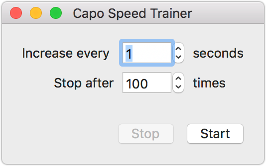
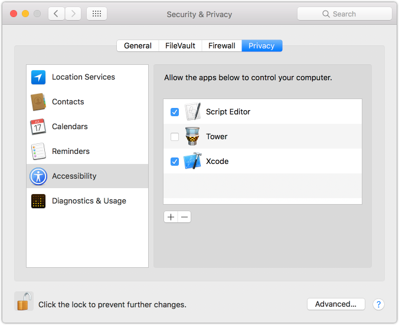

# CapoSpeedTrainer
Speed training with http://supermegaultragroovy.com/products/capo/. Increases the speed while playing a lick:

Every x seconds CapoSpeedTrainer invokes "Finely Increase Playback Speed" in the Control menu of Capo. Make sure to set the desired starting speed before.

# Accessibility Access
To access Capo, the app (or Xcode when run in debug mode) needs the right to control your computer. This can be enabled in 

System Preferences > Security & Privacy > Accessibility > Privacy:

Just enable / add the app there.

# Improvements

- Start playback in Capo when klicking "Start" in CapoSpeedTrainer
